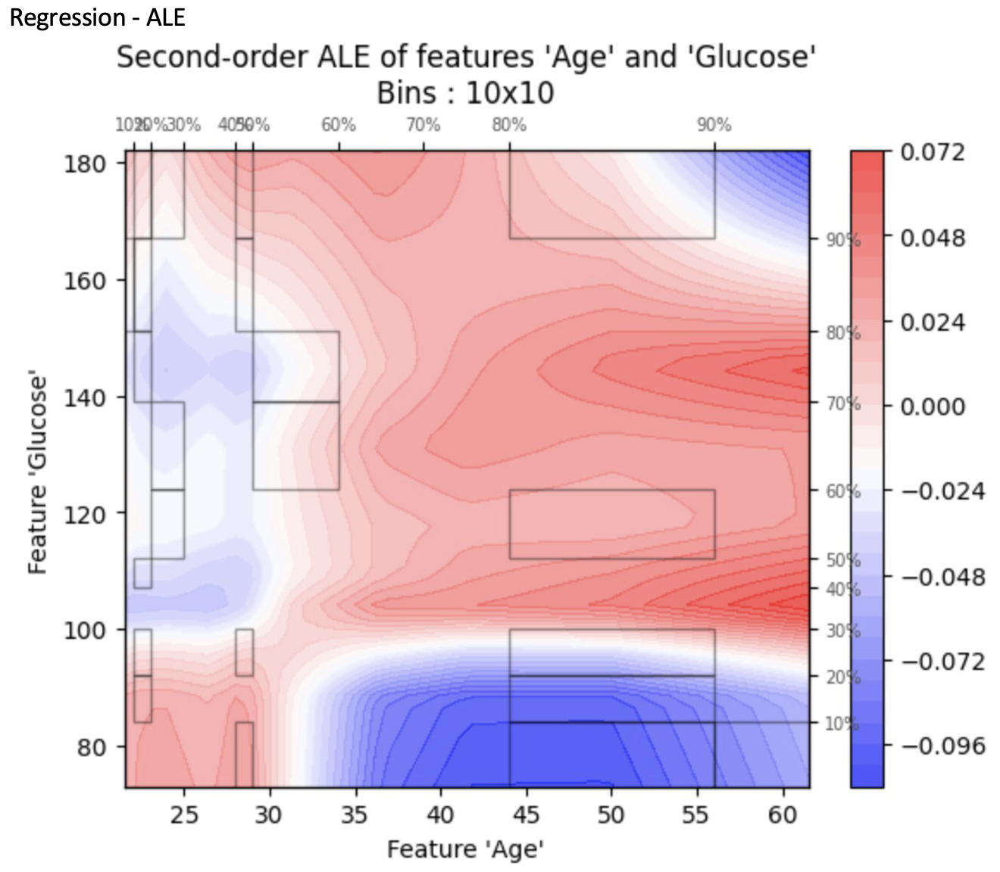

# XAI Analysis for Diabetes Prediction

## Description
This project applies Explainable AI (XAI) methods to the Pima Indian Diabetes dataset, leveraging various machine learning models to predict diabetes. The models used include Convolutional Neural Networks (CNN), Multi-Layer Perceptrons (MLP), Random Forest Regression, and Recurrent Neural Networks (RNN). Each model's predictions are interpreted using SHAP, LIME, and ALE, three of the most prominent XAI techniques, to provide insights into the decision-making process of each algorithm.

## XAI Techniques
- **SHAP (SHapley Additive exPlanations)**: SHAP values interpret the impact of having a certain value for a given feature in comparison to the prediction we'd make if that feature took some baseline value. It's a game theoretic approach to explain the output of any machine learning model.
  
- **LIME (Local Interpretable Model-agnostic Explanations)**: LIME helps us understand the predictions of any classifier in an interpretable and faithful manner, by approximating it locally with an interpretable model.
  
- **ALE (Accumulated Local Effects)**: ALE plots show the main effects of features and are a faster alternative to partial dependence plots (PDPs), which explain the features' contributions based on the accumulation of local effects.

## Model Performance
The accuracies achieved by our models on the Pima Indian Diabetes dataset are as follows:
- MLP: 75%
- CNN: 70%
- RNN: 80%
- Random Forest Regression: F-score of 30%

## Dataset
The dataset utilized is the Pima Indian Diabetes dataset, which consists of several medical predictor variables and one target variable, Outcome. Predictor variables include the number of pregnancies the patient has had, their BMI, insulin level, age, and so on.

## Output
Multiple graphs for each XAI model under each ml model were compared which can be seen in the Comparative Study PDF.

The primary comparisons were:

### SHAP summary plots 

### LIME plots

### SHAP vs LIME plots

### ALE plots

## Acknowledgments
- Credit to the creators of the Pima Indian Diabetes dataset.
- Thanks to the developers and contributors of SHAP, LIME, and ALE for their accessible and powerful XAI frameworks.
